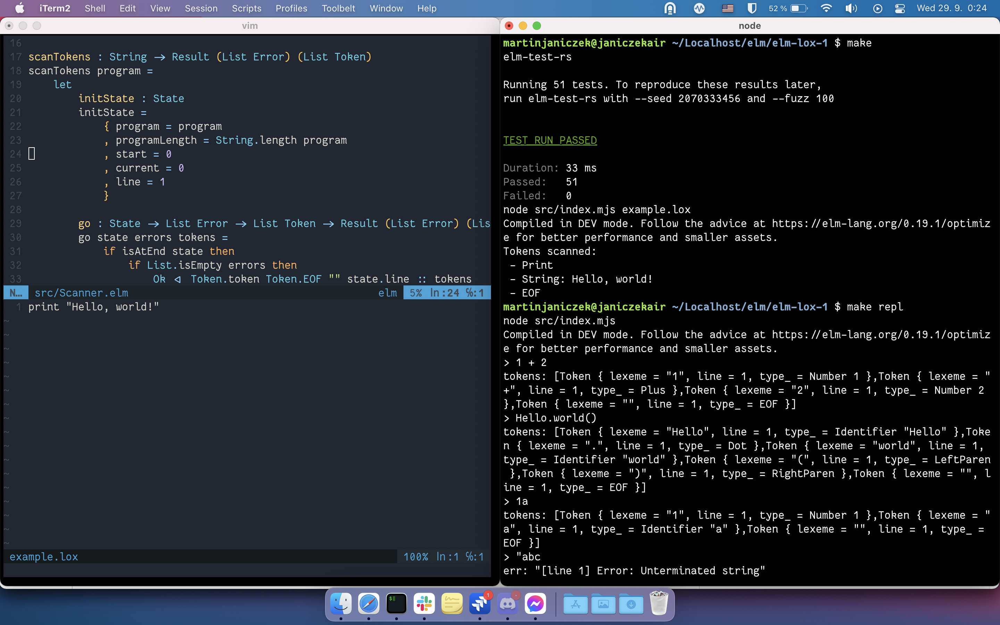

# elm-lox-1

A port of the `jlox` interpreter from "Crafting Interpreters".

## TODO

- [ ] Implement everything :)
- [ ] Ask to be added in [the list of Lox implementations](https://github.com/munificent/craftinginterpreters/wiki/Lox-implementations)
